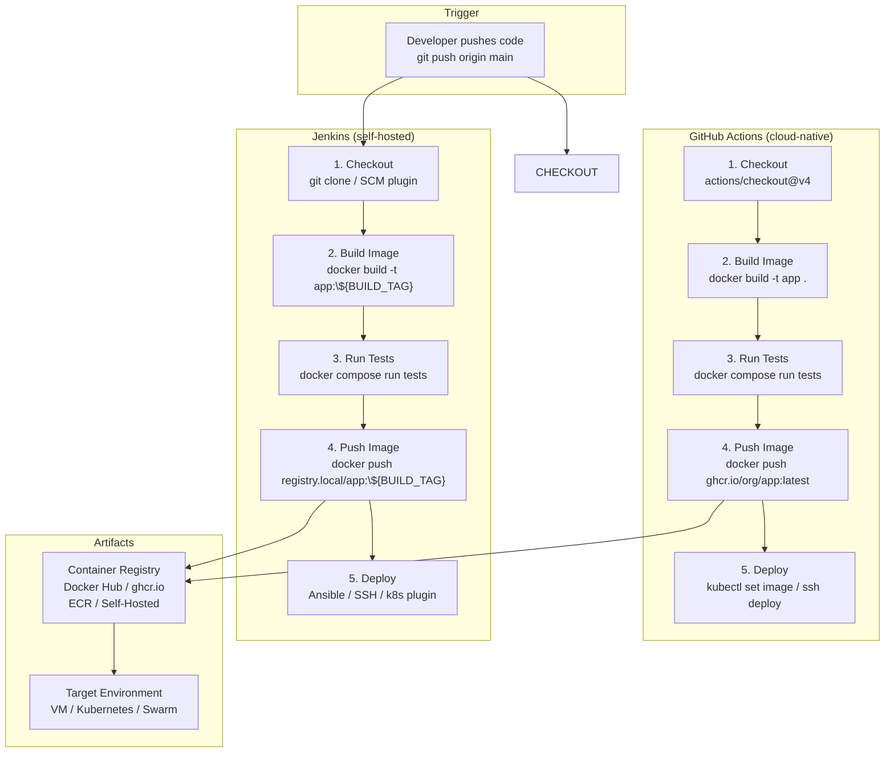

# CI/CD Pipeline with Docker

A continuous integration and deployment pipeline. Code pushed to GitHub triggers a build → test → package → deploy workflow. Both GitHub Actions and Jenkins are shown as parallel automation options.

**Stage breakdown:**

| # | Stage | Docker Role | What Happens |
|---|---|---|---|
| 1 | **Checkout** | — | Source code is pulled from the repository |
| 2 | **Build** | `docker build` | Multi-stage Dockerfile compiles code and produces a slim runtime image |
| 3 | **Test** | `docker compose run` | Integration tests spin up ephemeral services (DB, Redis, etc.) and run against the freshly built image |
| 4 | **Push** | `docker push` | Tagged image is uploaded to a registry (`latest`, `v1.2.3`, `sha-abc123`) |
| 5 | **Deploy** | `docker pull` + restart | Target host pulls the new image and replaces running containers (zero-downtime via blue/green or rolling update) |

**Docker-specific benefits in CI/CD:**
- **Reproducible environments** — "Works on my machine" is eliminated by using the same image from build through production
- **Immutable artifacts** — The image tested is the exact same image deployed (no recompilation)
- **Parallelism** — Multiple CI agents can build and test without interfering
- **Ephemeral test infrastructure** — `docker compose up --abort-on-container-exit` tears down automatically
