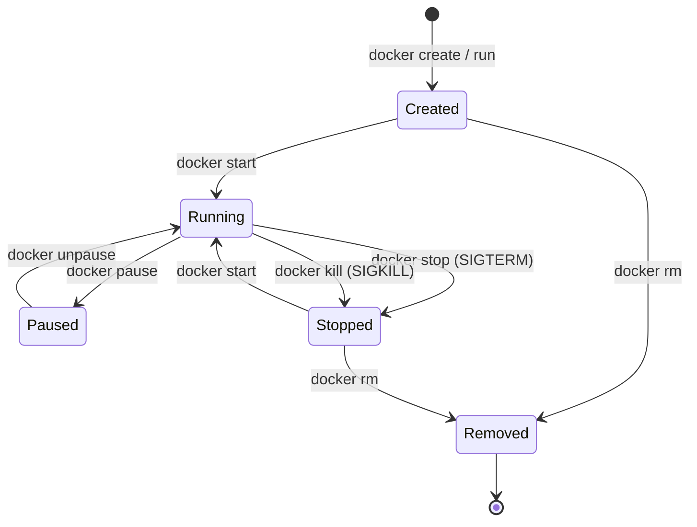

# Container Lifecycle

The states a container transitions through during its lifetime — from creation through running, pausing, stopping, and finally removal.

**Common workflows:**

| Action | Command | Signal / Behavior |
|---|---|---|
| Create | `docker create nginx` | Writes the writable layer, prepares filesystem |
| Start | `docker start <id>` | Runs the entrypoint process |
| Pause | `docker pause <id>` | SIGSTOP — freezes all processes via cgroup freezer |
| Unpause | `docker unpause <id>` | SIGCONT — resumes processes |
| Stop | `docker stop <id>` | SIGTERM (graceful), then SIGKILL after timeout |
| Kill | `docker kill <id>` | SIGKILL (immediate) |
| Remove | `docker rm <id>` | Deletes the container metadata and writable layer |

**Note:** Containers in the `Removed` state still exist on disk until `docker rm -v` explicitly cleans up volumes attached to the container. Orphaned images can be cleaned with `docker system prune`.
