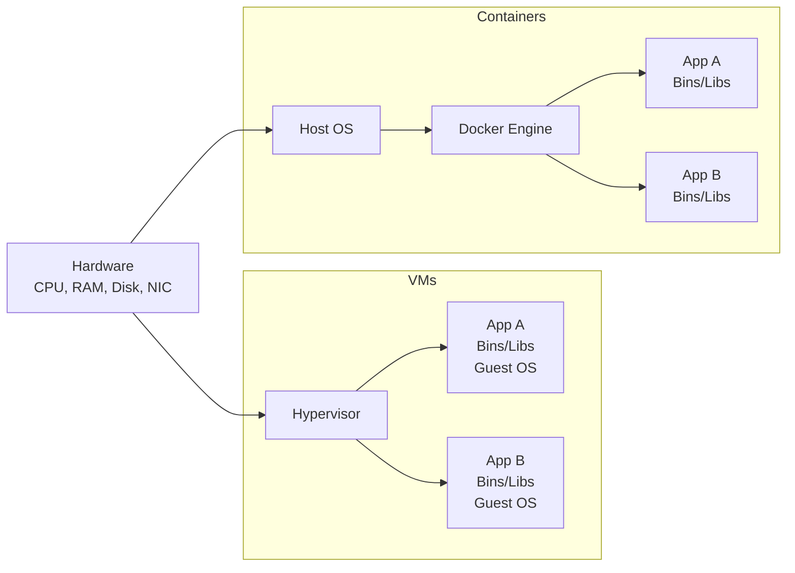

# Containers vs. Virtual Machines

A visual comparison of traditional VM architecture (hypervisor-based) versus container architecture (OS-level virtualization). Containers share the host OS kernel and are more lightweight, while each VM includes a full guest OS.

**Key differences:**
- **VMs:** Each VM runs a full guest OS → GBs of overhead, minutes to boot, full isolation
- **Containers:** Containers share the host kernel → MBs of overhead, seconds to boot, process-level isolation
