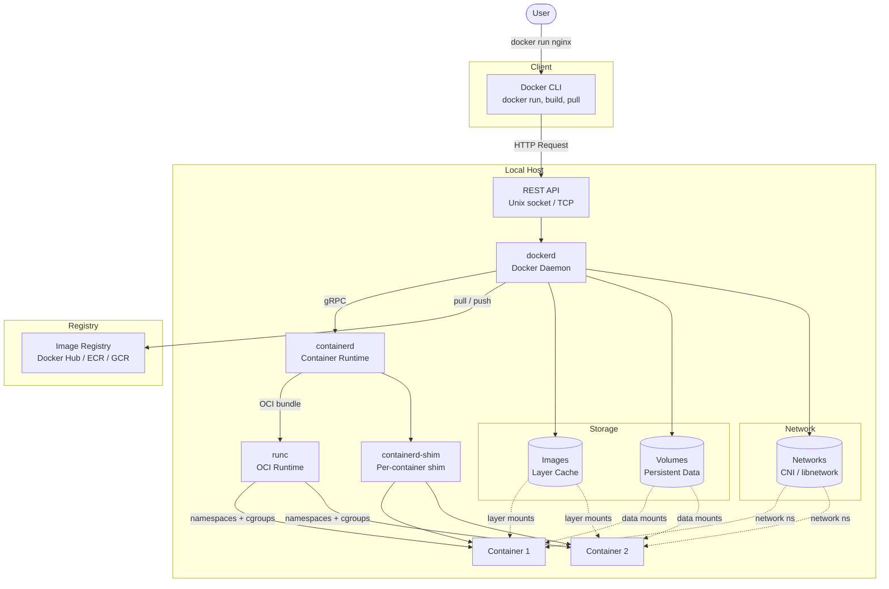

# Docker Architecture

How the Docker CLI, daemon, and lower-level components interact to run containers. The user issues commands to the Docker CLI, which communicates via REST API to `dockerd`, which delegates to `containerd` and `runc` for actual container lifecycle management.

**Layer overview:**
1. **Docker CLI** — user-facing command-line tool
2. **REST API** — HTTP interface exposed on `/var/run/docker.sock`
3. **dockerd** — the long-running daemon that manages objects (containers, images, volumes, networks)
4. **containerd** — industry-standard container runtime, manages image transfer and container lifecycle
5. **containerd-shim** — per-container process that keeps the container's stdio open after runc exits
6. **runc** — low-level OCI runtime that creates the actual container (cgroups, namespaces)
