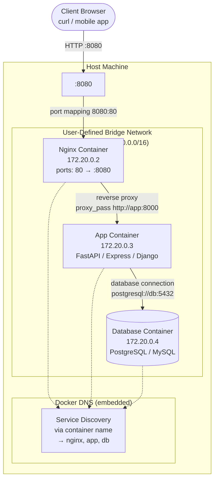

# Docker Network Topology

A three-tier web application running on a single host: the client reaches an Nginx reverse proxy (port 8080), which forwards to a backend app service, which connects to a database — all on a user-defined bridge network.



**Network details:**

| Container | Hostname | IP Address | Exposed Ports | Purpose |
|---|---|---|---|---|
| Nginx | `nginx` | 172.20.0.2 | 80 (mapped to host 8080) | Reverse proxy, TLS termination, static assets |
| App | `app` | 172.20.0.3 | 8000 | Business logic, API handlers |
| DB | `db` | 172.20.0.4 | 5432 | Persistent data storage |

**How service discovery works:**

On a user-defined bridge network, Docker provides automatic DNS resolution. Containers can reach each other by name (e.g., `http://app:8000` or `postgresql://db:5432`). The default `bridge` network does **not** provide this — you must use `--network myapp_net` with a user-defined bridge.

**Corresponding `docker-compose.yml` snippet:**

```yaml
services:
  nginx:
    image: nginx:alpine
    ports:
      - "8080:80"
    networks:
      - myapp_net

  app:
    image: myapp:latest
    networks:
      - myapp_net

  db:
    image: postgres:16
    networks:
      - myapp_net

networks:
  myapp_net:
    driver: bridge
    ipam:
      config:
        - subnet: "172.20.0.0/16"
```
