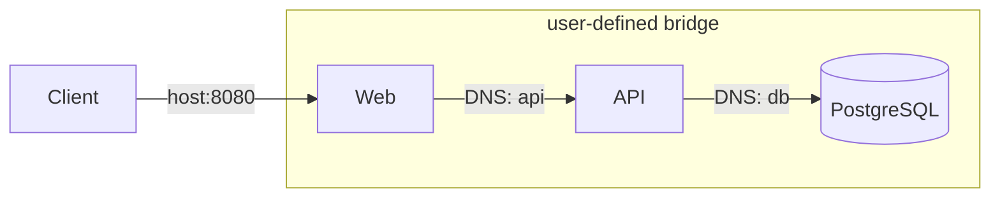

# Docker Networking Cheatsheet
Network drivers, DNS, and port publishing for container connectivity.

## Network drivers

| Driver | Use case |
|---|---|
| `bridge` | Default single-host networking |
| `host` | Container uses host network stack |
| `none` | No networking |
| `overlay` | Multi-host (Swarm) |
| `macvlan` | Container gets MAC on physical network |

## Key commands

```bash
docker network create mynet
docker network ls
docker network inspect mynet
docker network connect mynet mycontainer
docker network disconnect mynet mycontainer
docker network rm mynet
```

## Run with network

```bash
docker run -d --name api --network mynet myimage:1.0
docker run -d --name db --network mynet --network-alias postgres postgres:16
```

## Port publishing

| Syntax | Meaning |
|---|---|
| `-p 8080:80` | Host 8080 → container 80 |
| `-p 127.0.0.1:8080:80` | Bind to localhost only |
| `-P` | Publish all `EXPOSE` ports to random host ports |
| `expose: "80"` in Compose | Expose to other services, not host |

## DNS resolution rules

- On a **user-defined bridge**, containers resolve each other by **service/container name** and **network alias**.
- On the **default bridge**, containers do **not** get automatic DNS by name—use `--link` (legacy) or a user-defined network.
- In **Compose**, service names become DNS hostnames on the project network.

## Multi-container topology (concept)



## Gotchas

1. **`localhost` inside a container** — Refers to the container itself, not the host or another container.
2. **Host access from container** — On Docker Desktop, use `host.docker.internal`; on Linux, use host gateway IP or `host` network mode.
3. **Published port conflicts** — Only one process can bind a host port; change the host side of `-p`.
4. **Firewall rules** — Published ports must be allowed through host firewalls.
5. **`host` network mode** — Skips isolation; ports bind directly on the host.

## Deeper reading

- [Module 07 — Networking](../modules/07-networking/README.md)
- [Module 16 — Docker Swarm](../modules/16-docker-swarm/README.md)
