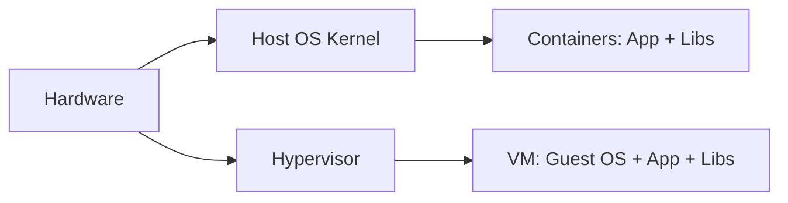

# Module 01 Notes — Introduction to Docker
[Previous: Module 00 — Prerequisites](../00-prerequisites/README.md) | [Next: Module 02 — Installation](../02-installation/README.md)

## What Docker is
**Concept:** Docker is a platform for building, shipping, and running containers.

**Why it exists:** It removes environment drift so your app behaves the same on every machine.

**How it works internally:** Docker packages your app into an image and runs it as an isolated container.

**Command/Syntax:**
```bash
docker version
```
```text
Client: Docker Engine - Community
 Server: Docker Engine - Community
```

**Real example:**
```bash
docker info --format '{{.ServerVersion}}'
```
```text
25.0.2
```

> 💡 **Pro Tip:** You use `docker info` to confirm the daemon is running before debugging a command.

## Brief history
**Concept:** Docker starts as dotCloud and becomes Docker Inc. in 2013.

**Why it exists:** The project evolves to standardize containers across Linux environments.

**How it works internally:** The Docker Engine builds on Linux namespaces and cgroups to isolate processes.

**Command/Syntax:**
```bash
docker info --format '{{.OperatingSystem}}'
```
```text
Ubuntu 22.04.4 LTS
```

**Real example:**
```bash
docker info --format '{{.Driver}}'
```
```text
overlay2
```

## The problem Docker solves
**Concept:** Docker solves the “works on my machine” problem.

**Why it exists:** Teams need the same runtime across laptops, CI, and production.

**How it works internally:** Images lock dependencies and configuration into a portable artifact.

**Command/Syntax:**
```bash
docker image ls
```
```text
REPOSITORY   TAG     IMAGE ID
```

**Real example:**
```bash
docker pull alpine:3.20
```
```text
3.20: Pulling from library/alpine
Status: Downloaded newer image for alpine:3.20
```

## Docker ecosystem overview
**Concept:** The ecosystem includes Engine, Hub, Compose, Swarm, and Desktop.

**Why it exists:** Each tool covers a different part of build, run, share, and orchestration.

**How it works internally:** Docker Engine runs containers, while Hub stores images and Compose defines multi-service apps.

**Command/Syntax:**
```bash
docker compose version
```
```text
Docker Compose version v2.24.6
```

**Real example:**
```bash
docker search nginx | head -n 1
```
```text
NAME      DESCRIPTION                STARS
nginx     Official build of Nginx.   20000
```

> ⚠️ **Common Mistake:** You confuse Docker Desktop with Docker Engine on Linux. Desktop is optional on Linux.

## Docker architecture (client-server)
**Concept:** Docker uses a client-server model with a REST API.

**Why it exists:** The CLI and API let you automate builds and runs in scripts and CI.

**How it works internally:** The CLI talks to the daemon over a Unix socket or TCP, and the daemon performs the work.

**Command/Syntax:**
```bash
docker version --format '{{.Client.Version}}'
```
```text
25.0.2
```

**Real example:**
```bash
docker version --format '{{.Server.Version}}'
```
```text
25.0.2
```

## Container vs VM
**Concept:** Containers share the host kernel while VMs run a full guest OS.

**Why it exists:** Containers start fast and use fewer resources for most workloads.

**How it works internally:** Namespaces isolate processes, while VMs isolate hardware with a hypervisor.

**Command/Syntax:**
```bash
docker run --rm alpine:3.20 uname -a
```
```text
Linux 4f0d2b7a8d0a 6.8.0 #1 SMP x86_64 Linux
```

**Real example:**
```bash
docker run --rm alpine:3.20 cat /etc/os-release
```
```text
NAME="Alpine Linux"
VERSION_ID=3.20.0
```



## What’s Next?
You install Docker on your operating system in Module 02.

[Previous: Module 00 — Prerequisites](../00-prerequisites/README.md) | [Next: Module 02 — Installation](../02-installation/README.md)
