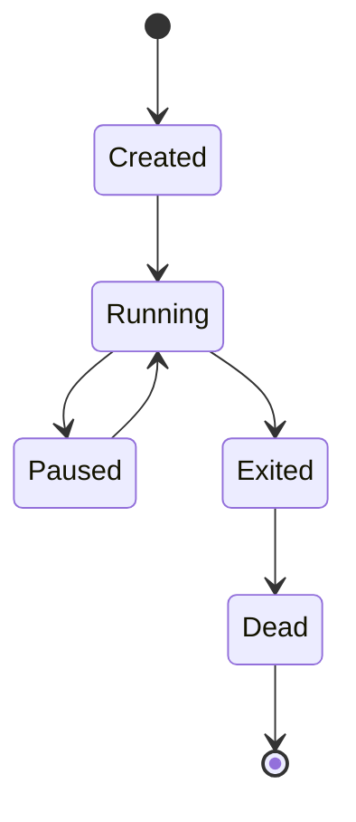

# Module 03 Notes — Core Concepts
[Previous: Module 02 — Installation](../02-installation/README.md) | [Next: Module 04 — Images](../04-images/README.md)

## Images vs containers
**Concept:** An image is a template, and a container is a running instance of that template.

**Why it exists:** You build once as an image and run many containers from it.

**How it works internally:** The image is read-only layers, and the container adds a writable layer.

**Command/Syntax:**
```bash
docker images
```
```text
REPOSITORY   TAG     IMAGE ID
alpine       3.20    0d3f7b5f2f
```

**Real example:**
```bash
docker run --rm alpine:3.20 echo "container"
```
```text
container
```

> 💡 **Pro Tip:** You tag images with versions so containers stay reproducible.

## Layers and the union file system
**Concept:** Images are built from layers stacked by a union file system.

**Why it exists:** Layers allow caching and reuse across images.

**How it works internally:** The storage driver presents multiple layers as a single file system view.

**Command/Syntax:**
```bash
docker history alpine:3.20
```
```text
IMAGE          CREATED        CREATED BY
0d3f7b5f2f     2 weeks ago    /bin/sh -c #(nop)  CMD ["/bin/sh"]
```

**Real example:**
```bash
docker inspect alpine:3.20 --format '{{.RootFS.Layers}}'
```
```text
[sha256:...]
```

## Image lifecycle: pull, run, stop, remove
**Concept:** You pull images, run containers, stop them, and remove them when done.

**Why it exists:** The lifecycle keeps your system clean and your containers controlled.

**How it works internally:** The daemon caches images and tracks container state transitions.

**Command/Syntax:**
```bash
docker pull nginx:1.27
```
```text
Status: Downloaded newer image for nginx:1.27
```

**Real example:**
```bash
docker rm -f sample-nginx
```
```text
sample-nginx
```

## Container states
**Concept:** Containers move between created, running, paused, exited, and dead states.

**Why it exists:** State helps you understand if a container is running or needs attention.

**How it works internally:** The daemon updates state metadata on lifecycle events.

**Command/Syntax:**
```bash
docker ps -a
```
```text
CONTAINER ID   STATUS
9d2b3c4d5e6f   Exited (0) 2 minutes ago
```

**Real example:**
```bash
docker pause 9d2b3c4d5e6f
```
```text
9d2b3c4d5e6f
```



## Docker Hub as a registry
**Concept:** Docker Hub stores and distributes images.

**Why it exists:** A central registry makes sharing images simple.

**How it works internally:** The registry stores image layers and manifests, and the client pulls by tag.

**Command/Syntax:**
```bash
docker search redis | head -n 1
```
```text
NAME   DESCRIPTION        STARS
redis  Redis is a...      12000
```

**Real example:**
```bash
docker pull redis:7.2
```
```text
Status: Downloaded newer image for redis:7.2
```

> ⚠️ **Common Mistake:** You assume `latest` always means stable. Use explicit tags instead.

## What’s Next?
You learn to manage images in Module 04.

[Previous: Module 02 — Installation](../02-installation/README.md) | [Next: Module 04 — Images](../04-images/README.md)
