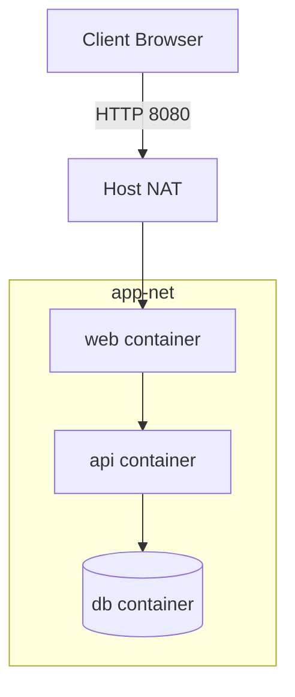

# Module 07 Notes — Docker Networking
[Previous: Module 06 — Volumes and Storage](../06-volumes-and-storage/README.md) | [Next: Module 08 — Docker Compose](../08-docker-compose/README.md)

## Network drivers
**Concept:** Docker provides bridge, host, none, overlay, and macvlan drivers.

**Why it exists:** Different environments need different isolation and performance tradeoffs.

**How it works internally:** Each driver configures Linux networking in a specific way.

**Command/Syntax:**
```bash
docker network ls
```
```text
NETWORK ID   NAME     DRIVER
abc123       bridge   bridge
```

**Real example:**
```bash
docker network inspect bridge --format '{{.Driver}}'
```
```text
bridge
```

## Default bridge limitations
**Concept:** The default bridge network lacks automatic DNS and isolation features.

**Why it exists:** It provides a simple starting point but is not ideal for multi-service apps.

**How it works internally:** Containers connect to a shared bridge with basic NAT rules.

**Command/Syntax:**
```bash
docker run --rm alpine:3.20 ping -c 1 127.0.0.1
```
```text
1 packets transmitted, 1 received, 0% packet loss
```

**Real example:**
```bash
docker network inspect bridge --format '{{.Internal}}'
```
```text
false
```

## User-defined bridge networks
**Concept:** You create custom bridge networks for better DNS and isolation.

**Why it exists:** Custom networks enable container name resolution and scoped traffic.

**How it works internally:** Docker sets up a dedicated bridge and embedded DNS server.

**Command/Syntax:**
```bash
docker network create app-net
```
```text
app-net
```

**Real example:**
```bash
docker network inspect app-net --format '{{.Name}}'
```
```text
app-net
```

> 💡 **Pro Tip:** You create one user-defined network per app to isolate traffic.

## Connecting containers with DNS
**Concept:** Containers on the same user-defined network resolve each other by name.

**Why it exists:** You avoid hard-coded IP addresses.

**How it works internally:** Docker’s embedded DNS server maps container names to IPs.

**Command/Syntax:**
```bash
docker run -d --name net-web --network app-net nginx:1.27
```
```text
9a8b7c6d5e4f
```

**Real example:**
```bash
docker run --rm --network app-net alpine:3.20 ping -c 1 net-web
```
```text
1 packets transmitted, 1 received, 0% packet loss
```

## `--network` flag
**Concept:** You attach containers to a specific network at run time.

**Why it exists:** It gives you control over container communication.

**How it works internally:** Docker connects the container’s network namespace to the chosen network.

**Command/Syntax:**
```bash
docker run -d --name net-api --network app-net nginx:1.27
```
```text
1a2b3c4d5e6f
```

**Real example:**
```bash
docker network connect app-net net-api
```
```text
```

## Exposing vs publishing ports
**Concept:** `EXPOSE` documents ports, while `-p` publishes them to the host.

**Why it exists:** Publishing is required for host access, exposing is not.

**How it works internally:** `-p` creates NAT rules on the host.

**Command/Syntax:**
```bash
docker run -d --name pub-web -p 8080:80 nginx:1.27
```
```text
4f3e2d1c0b9a
```

**Real example:**
```bash
docker port pub-web 80
```
```text
0.0.0.0:8080
```

## Network aliases
**Concept:** Aliases provide alternate DNS names for a container.

**Why it exists:** You can use stable names for service discovery.

**How it works internally:** Docker adds alias records to the embedded DNS.

**Command/Syntax:**
```bash
docker run -d --name net-db --network app-net --network-alias db postgres:16
```
```text
7e6d5c4b3a2f
```

**Real example:**
```bash
docker run --rm --network app-net alpine:3.20 ping -c 1 db
```
```text
1 packets transmitted, 1 received, 0% packet loss
```

> ⚠️ **Common Mistake:** You rely on container IPs, which change on restart.



## What’s Next?
You orchestrate multi-container apps with Docker Compose in Module 08.

[Previous: Module 06 — Volumes and Storage](../06-volumes-and-storage/README.md) | [Next: Module 08 — Docker Compose](../08-docker-compose/README.md)
