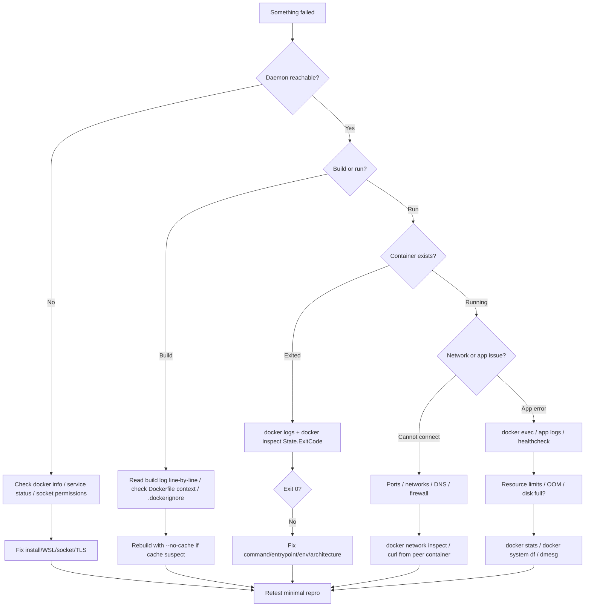

# Module 13 Notes — Troubleshooting and Debugging
[Previous: Module 12 — Performance and Resource Limits](../12-performance-and-resource-limits/README.md) | [Next: Module 14 — Docker Desktop vs Engine](../14-docker-desktop-vs-engine/README.md)

## General debugging flowchart

When something fails, you narrow the layer before changing random flags. Use this flow:



> 💡 **Pro Tip:** You reproduce with the smallest image (`alpine:3.20`) and one flag at a time so you know which change fixed the issue.

---

## Container exits immediately
**Problem:** `docker run` returns and `docker ps` shows nothing running; the container is `Exited`.

**Diagnostic commands:**
```bash
docker ps -a --filter name=myapp --format '{{.Names}} {{.Status}}'
docker logs myapp
docker inspect myapp --format 'ExitCode={{.State.ExitCode}} Error={{.State.Error}}'
```

**Fix:** You run foreground with `--rm` to see errors, or override `CMD` with `sh` to debug. You ensure the main process stays PID 1 (use `exec` in shell form entrypoints). You check that a one-shot command is not your default `CMD` when you expected a daemon.

```bash
docker run --rm alpine:3.20 echo done
```
```text
done
```

> ⚠️ **Common Mistake:** You use `docker run -d` with a script that exits after setup, so Docker stops the container when PID 1 ends.

---

## Port already in use
**Problem:** `docker run -p` fails with “address already in use” or bind errors.

**Diagnostic commands:**
```bash
docker ps --format '{{.Names}} {{.Ports}}' | grep 8080
# Linux
ss -tlnp | grep 8080
# Windows (PowerShell)
netstat -ano | findstr :8080
```

**Fix:** You stop the conflicting container, change the host port (`-p 8081:80`), or free the process on the host. Only one listener can bind a given host IP:port.

```bash
docker run -d -p 8081:80 --name web nginx:alpine
```
```text
a1b2c3d4e5f6
```

---

## Volume mount permission denied
**Problem:** The app cannot write to a bind mount or named volume path.

**Diagnostic commands:**
```bash
docker inspect myapp --format '{{json .Mounts}}'
docker exec myapp id
ls -la ./data
```

**Fix:** You align UID/GID (`--user`, Dockerfile `USER`, or `chown` on the host path). You avoid bind-mounting read-only unless intended. For SELinux hosts you may need `:z` or `:Z` on the mount (RHEL/Fedora).

```bash
docker run --rm -u 1000:1000 -v "$(pwd)/data:/data" alpine:3.20 touch /data/ok
```
```text
```

> 💡 **Pro Tip:** You use named volumes for databases on Windows/WSL2 instead of bind mounts under `/mnt/c/` to avoid permission and performance pain.

---

## Container can't reach the internet
**Problem:** `curl`, `apt`, or DNS fails inside the container but works on the host.

**Diagnostic commands:**
```bash
docker run --rm alpine:3.20 wget -qO- https://example.com | head -c 20
docker run --rm alpine:3.20 cat /etc/resolv.conf
docker network inspect bridge --format '{{json .IPAM.Config}}'
```

**Fix:** You check corporate proxy env vars (`HTTP_PROXY`). You reset Docker DNS in Desktop settings or daemon.json. You verify VPN or firewall rules do not block NAT from bridge networks.

```bash
docker run --rm --dns 8.8.8.8 alpine:3.20 nslookup example.com
```
```text
Name:	example.com
Address: 93.184.216.34
```

---

## Two containers can't talk to each other
**Problem:** Ping or HTTP between containers by name or IP fails.

**Diagnostic commands:**
```bash
docker network ls
docker network inspect mynet
docker exec containerA ping -c 2 containerB
```

**Fix:** You attach both containers to the same **user-defined** bridge (not legacy `bridge` links). You use service names on that network. You publish ports only when traffic comes from outside Docker, not between containers on the same network.

```bash
docker network create appnet
docker run -d --name api --network appnet nginx:alpine
docker run --rm --network appnet alpine:3.20 wget -qO- http://api
```
```text
<!DOCTYPE html>...
```

> ⚠️ **Common Mistake:** You expect DNS by container name on the default `bridge` network—it does not work the same way as on a user-defined network.

---

## Out of disk space (images and volumes)
**Problem:** Builds fail with “no space left on device”; pulls hang or error.

**Diagnostic commands:**
```bash
docker system df -v
df -h /var/lib/docker
```

**Fix:** You prune unused data (`docker system prune`, `docker volume prune`, `docker builder prune`). You remove dangling images and old tags. You move Docker data root only with care and daemon.json planning.

```bash
docker system prune -f
```
```text
Deleted Images:
...
Total reclaimed space: 1.2GB
```

---

## Build cache bloat
**Problem:** Builds are slow and disk usage grows; stale layers hide Dockerfile bugs.

**Diagnostic commands:**
```bash
docker buildx du
docker history myimage:latest | head
```

**Fix:** You reorder Dockerfile so dependency layers change less often. You use `docker build --no-cache` when debugging cache issues. You run `docker builder prune` periodically.

```bash
docker build --no-cache -t myapp:test .
```
```text
Successfully tagged myapp:test
```

> 💡 **Pro Tip:** You use BuildKit cache mounts (`--mount=type=cache`) for package managers without copying cache into final layers (Module 09).

---

## "exec format error" (wrong architecture)
**Problem:** Container exits immediately with `exec format error` in logs.

**Diagnostic commands:**
```bash
docker inspect myimage --format '{{.Architecture}}'
uname -m
docker version --format '{{.Server.Arch}}'
```

**Fix:** You build for the host arch or use `docker buildx build --platform linux/amd64` (or arm64) to match deploy targets. You do not run ARM-only binaries on AMD64 hosts without emulation.

```bash
docker run --rm --platform linux/amd64 alpine:3.20 uname -m
```
```text
x86_64
```

---

## Slow container startup
**Problem:** First start takes many seconds; deploys feel sluggish.

**Diagnostic commands:**
```bash
time docker run --rm myimage:latest echo up
docker image inspect myimage:latest --format '{{.Size}}'
```

**Fix:** You shrink images (multi-stage, slim bases). You reduce layer count and pull size. You avoid heavy init scripts at boot. On Mac/Windows you keep project files in the Linux filesystem (WSL2) for I/O-bound apps.

```bash
docker pull alpine:3.20
time docker run --rm alpine:3.20 true
```
```text
real	0m0.3s
```

---

## Environment variables not being picked up
**Problem:** The app does not see expected config inside the container.

**Diagnostic commands:**
```bash
docker inspect myapp --format '{{json .Config.Env}}'
docker exec myapp env | sort
```

**Fix:** You pass `-e` or `--env-file` at run time, or `environment` / `env_file` in Compose. You distinguish build-time `ARG` from runtime `ENV`. You restart after changing Compose env—containers do not hot-reload env.

```bash
docker run --rm -e APP_MODE=debug alpine:3.20 sh -c 'echo $APP_MODE'
```
```text
debug
```

> ⚠️ **Common Mistake:** You edit `.env` but run `docker run` without `--env-file`, so only Compose projects load that file automatically.

---

## Docker daemon not starting
**Problem:** `docker ps` fails with “Cannot connect to the Docker daemon” or service errors.

**Diagnostic commands:**
```bash
docker version
# Linux
sudo systemctl status docker
# Docker Desktop
# Check whale icon / Settings → Troubleshoot → Restart
```

**Fix:** You start the service (`sudo systemctl start docker`). You confirm your user is in the `docker` group on Linux. On WSL2/Windows you restart Docker Desktop and ensure WSL integration is enabled. You check disk space and that no other VM blocks hypervisor resources.

```bash
docker info 2>&1 | head -n 5
```
```text
Client: Docker Engine - Community
 Version:           25.0.0
...
```

---

## Container memory killed (OOM)
**Problem:** Container stops with exit code 137 or `OOMKilled: true`.

**Diagnostic commands:**
```bash
docker inspect myapp --format 'OOMKilled={{.State.OOMKilled}} ExitCode={{.State.ExitCode}}'
docker stats --no-stream myapp
dmesg | grep -i oom | tail -n 3
```

**Fix:** You raise `--memory` if the limit is too low, or fix the leak. You do not disable OOM without understanding host risk. You align JVM/Node heap with cgroup limits.

```bash
docker run --rm --memory 32m alpine:3.20 sh -c "dd if=/dev/zero of=/dev/shm/x bs=1M count=64" 2>&1; echo exit:$?
```
```text
Killed
exit:137
```

> 💡 **Pro Tip:** Exit code **137** means 128 + 9 (SIGKILL)—often OOM or manual `docker kill`.

---

## What’s Next?
You compare Docker Desktop and Docker Engine in Module 14 — Docker Desktop vs Docker Engine.

[Previous: Module 12 — Performance and Resource Limits](../12-performance-and-resource-limits/README.md) | [Next: Module 14 — Docker Desktop vs Engine](../14-docker-desktop-vs-engine/README.md)
