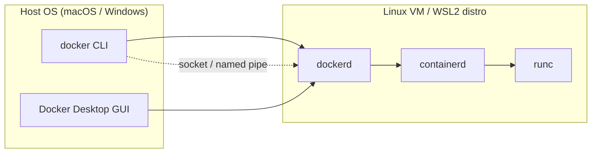

# Module 14 Notes — Docker Desktop vs Docker Engine
[Previous: Module 13 — Troubleshooting](../13-troubleshooting/README.md) | [Next: Module 15 — Docker on Windows with WSL2](../15-docker-on-windows-wsl2/README.md)

## What Docker Engine is
**Concept:** Docker Engine is the open-source runtime: the `dockerd` daemon, containerd, and the `docker` CLI.

**Why it exists:** It is the core technology that builds, runs, and manages containers on Linux.

**How it works internally:** The CLI talks to `dockerd` over a Unix socket (or TCP with TLS). `dockerd` schedules containers via containerd and runc.

**Command/Syntax:**
```bash
docker version
```
```text
Client: Docker Engine - Community
 Server: Docker Engine - Community
```

**Real example:** On Ubuntu you install Engine with the official apt repository and run containers natively on the host kernel—no extra VM layer.

## What Docker Desktop is
**Concept:** Docker Desktop is a packaged product that installs Docker Engine (or equivalent runtime) plus a GUI, integrations, and platform-specific virtualization.

**Why it exists:** macOS and Windows do not run Linux containers natively on the host kernel. Desktop provides a supported, batteries-included developer experience.

**How it works internally:** On Mac, Desktop runs Linux in a lightweight VM (Apple Virtualization Framework or HyperKit historically). On Windows, it uses WSL2 or Hyper-V backends. The CLI you type still talks to `dockerd`, but that daemon runs inside the Linux environment Desktop manages.

**Command/Syntax:**
```bash
docker context ls
```
```text
NAME                DESCRIPTION                               DOCKER ENDPOINT
default             Current DOCKER_HOST based configuration   ...
desktop-linux *     Docker Desktop                            unix:///...
```

**Real example:** You install Docker Desktop on a MacBook, open the GUI to see running containers, and use the same `docker run` commands as on Linux.

## Platform support matrix

| Platform | Docker Engine (native) | Docker Desktop |
|---|---|---|
| Linux (Ubuntu, Debian, Fedora, etc.) | Primary, supported | Optional (less common on servers) |
| macOS (Intel / Apple Silicon) | Not native | Primary path for developers |
| Windows | Via WSL2 or Linux VM only | Primary path for developers |

> 💡 **Pro Tip:** Production Linux servers almost always use Docker Engine (or containerd/kubernetes directly)—not Docker Desktop.

## Docker Desktop architecture on Mac and Windows



On Linux, the diagram collapses: `docker` CLI connects to `dockerd` on the same machine with no Desktop VM in between.

## Feature differences

| Capability | Docker Engine | Docker Desktop |
|---|---|---|
| Core CLI (`run`, `build`, `compose`) | Yes | Yes (bundled Compose v2 plugin) |
| Graphical dashboard | No | Yes |
| Kubernetes one-click | No (install separately) | Optional built-in cluster |
| Dev Environments / Extensions | No | Yes (Desktop ecosystem) |
| Docker Scout / Hub integration UI | CLI only | GUI + CLI |
| Resource limits UI (CPU/RAM/disk) | OS / cgroup only | Settings panel |
| Automatic updates | Package manager | Desktop updater |

**Concept:** Desktop adds developer ergonomics; Engine is the minimal runtime.

**Why it exists:** GUI and integrations lower the barrier for local development on non-Linux desktops.

## Licensing (Docker Desktop for business)
**Concept:** Docker Desktop is free for personal use, education, and small business under current Docker subscription terms. Larger organizations may need a paid Docker subscription.

**Why it exists:** Docker Inc. funds Desktop development through commercial licensing.

**How it works internally:** License acceptance is part of the Desktop installer; enterprise admins distribute licensed builds via MDM.

**Command/Syntax:** There is no CLI flag for licensing—you comply via install terms and organizational policy.

**Real example:** A solo developer uses Desktop free. A Fortune 500 company consults Docker’s subscription FAQ and may standardize on Engine-in-CI plus approved Desktop seats for engineers.

> ⚠️ **Common Mistake:** Assuming “Docker is always free everywhere.” Engine remains open source; Desktop distribution terms differ for large commercial use—verify current Docker documentation for your organization.

## When to use Desktop vs Engine

| Situation | Recommendation |
|---|---|
| Developer laptop on macOS/Windows | Docker Desktop |
| CI/CD Linux runner | Docker Engine or BuildKit in runner image |
| Production VM / bare metal Linux | Docker Engine (or orchestrator-managed runtime) |
| Air-gapped enterprise | Engine packages + private registry; Desktop only if policy allows |
| Need only CLI on Linux laptop | Engine alone is enough |

## Performance: Mac/Windows vs native Linux
**Concept:** On Mac and Windows, every container runs in a Linux environment behind a virtualization boundary. File system and bind-mount I/O across that boundary is slower than on native Linux.

**Why it exists:** The host kernel is not Linux; I/O and networking must cross a VM/WSL boundary.

**How it works internally:** Desktop optimizes virtiofs and WSL2 filesystem integration, but heavy bind mounts from `/Users` or `C:\` into containers remain a common bottleneck.

**Command/Syntax:**
```bash
docker run --rm -v "$(pwd):/app" -w /app alpine:3.20 sh -c "dd if=/dev/zero of=/app/test bs=1M count=100"
```
```text
100+0 records in
100+0 records out
```

**Real example:** You clone a Node project into the WSL2 filesystem (`~/projects`) instead of `/mnt/c/Users/...` and see faster `npm install` inside containers. Module 15 covers this in depth for Windows.

> 💡 **Pro Tip:** Store project files inside the Linux side (WSL2 home or Desktop’s Linux VM) when bind-mounting into containers on Mac/Windows.

## CLI equivalence
**Concept:** The `docker` and `docker compose` commands are the same whether you target Engine or Desktop—the endpoint changes, not the syntax.

**Why it exists:** Skills transfer across environments.

**How it works internally:** `docker context` selects which daemon receives API calls.

**Command/Syntax:**
```bash
docker context use default
docker info --format '{{.Name}}'
```
```text
docker-desktop
```

**Real example:** You SSH to a Linux server and run the same `docker compose up` you used locally on Desktop.

## Desktop settings that matter
**Concept:** Desktop exposes CPU, memory, disk image size, and file-sharing controls that cap what your containers can use.

**Why it exists:** Without limits, containers could starve the host OS.

**How it works internally:** The Linux VM or WSL2 distro is allocated a slice of host RAM and CPUs; `docker stats` still reports per-container usage inside that slice.

**Settings to review:**
- **Resources:** Raise memory if builds fail with OOM; lower if your host becomes sluggish.
- **File sharing / WSL integration:** Only share directories you need.
- **Kubernetes:** Disable if unused—it consumes RAM.
- **General:** Choose WSL2 backend on Windows (covered in Module 15).

**Command/Syntax:**
```bash
docker system df
```
```text
TYPE            TOTAL     ACTIVE    SIZE
Images          12        5         4.2GB
```

**Real example:** You increase Desktop RAM from 2 GiB to 8 GiB and a previously failing `docker build` completes.

> ⚠️ **Common Mistake:** Blaming Dockerfiles for OOM during build when Desktop’s VM memory cap is still at the default minimum.

## Verifying what you are running
**Concept:** `docker info` and `docker version` reveal server OS, cgroup driver, and context.

**Why it exists:** Troubleshooting differs between native Engine and Desktop-backed daemons.

**Command/Syntax:**
```bash
docker info | grep -E 'Operating System|Server Version|Docker Root Dir'
```
```text
 Server Version: 27.x.x
 Operating System: Docker Desktop
```

**Real example:** On Ubuntu Server, Operating System shows `Ubuntu 24.04 LTS` instead of `Docker Desktop`.

## What's Next?
You set up Docker on Windows with WSL2 in depth in Module 15.

[Previous: Module 13 — Troubleshooting](../13-troubleshooting/README.md) | [Next: Module 15 — Docker on Windows with WSL2](../15-docker-on-windows-wsl2/README.md)
