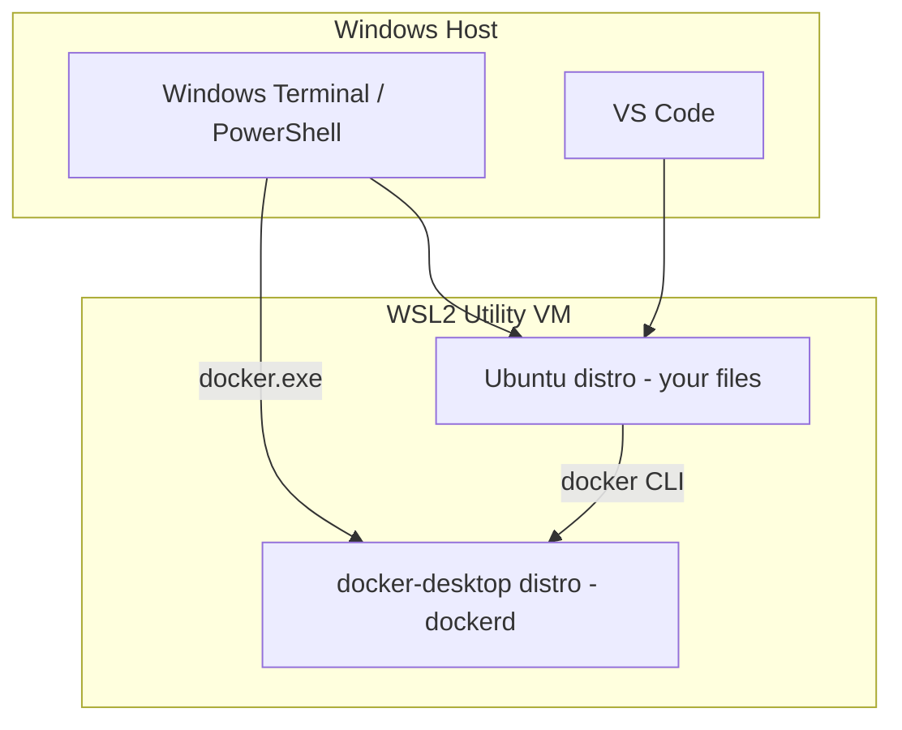

# Module 15 Notes — Docker on Windows with WSL2
[Previous: Module 14 — Docker Desktop vs Engine](../14-docker-desktop-vs-engine/README.md) | [Next: Module 16 — Docker Swarm](../16-docker-swarm/README.md)

## Why Docker on Windows needs WSL2
**Concept:** Linux containers need a Linux kernel. Windows containers use a different isolation model; most learning and production workloads use **Linux containers**.

**Why it exists:** Running Linux containers on Windows without a Linux kernel layer is not possible the same way as on Ubuntu.

**How it works internally:** WSL2 runs a real Linux kernel inside a lightweight utility VM. Docker Desktop’s WSL2 backend runs `dockerd` inside a WSL2 distro, so `docker run` executes Linux containers with proper syscall support.

**Command/Syntax:**
```powershell
wsl --status
```
```text
Default Version: 2
```

**Real example:** You develop a Python API on Windows 11, use Docker Desktop with WSL2, and run `python:3.12-slim` images identically to teammates on macOS.

> ⚠️ **Common Mistake:** Staying on WSL1. Docker Desktop requires WSL2 for the recommended backend.

## Enable WSL2 and Virtual Machine Platform
**Concept:** Windows features must be on before WSL2 and Docker work reliably.

**Why it exists:** WSL2 depends on Hyper-V–class virtualization components.

**How it works internally:** The Virtual Machine Platform and WSL features install optional Windows components; a reboot is often required.

**Command/Syntax (PowerShell as Administrator):**
```powershell
wsl --install
```
```text
Installing: Windows Subsystem for Linux
Installing: Virtual Machine Platform
```

**Real example:** On a fresh Windows 11 machine, `wsl --install` installs Ubuntu by default and sets WSL2 as the default version after reboot.

**Manual feature path (older Windows 10):**
```powershell
dism.exe /online /enable-feature /featurename:VirtualMachinePlatform /all /norestart
dism.exe /online /enable-feature /featurename:Microsoft-Windows-Subsystem-Linux /all /norestart
```
```text
The operation completed successfully.
```

```powershell
wsl --set-default-version 2
```
```text
For information on key differences with WSL 2 please visit https://aka.ms/wsl2
```

## Install a Linux distro in WSL2
**Concept:** A WSL distro is your Linux userland (Ubuntu, Debian, etc.).

**Why it exists:** Docker Desktop integrates with one or more distros for CLI workflows and file paths.

**How it works internally:** Each distro is a separate ext4 virtual disk; processes run in the WSL2 utility VM.

**Command/Syntax:**
```powershell
wsl --list --online
```
```text
NAME            FRIENDLY NAME
Ubuntu          Ubuntu
Debian          Debian GNU/Linux
```

```powershell
wsl --install -d Ubuntu
```
```text
Launching Ubuntu...
```

**Real example:** You open **Ubuntu** from the Start menu, create your Linux user, and run `uname -r` to confirm a Microsoft kernel string.

```bash
uname -r
```
```text
5.15.x.x-microsoft-standard-WSL2
```

## Install Docker Desktop with WSL2 backend
**Concept:** Docker Desktop for Windows configures `dockerd` to run inside WSL2 when the WSL2 engine is selected.

**Why it exists:** It is the supported developer path on Windows.

**How it works internally:** Desktop creates or uses a `docker-desktop` WSL distro and wires the Windows `docker.exe` CLI to that daemon.

**Steps:**
1. Download Docker Desktop for Windows from Docker’s official site.
2. Run the installer; enable **Use WSL 2 instead of Hyper-V** when prompted (recommended on Win10 21H2+ and Win11).
3. Restart if asked.
4. Confirm the whale icon shows **Engine running**.

**Command/Syntax:**
```powershell
docker run --rm hello-world
```
```text
Hello from Docker!
```

**Real example:** From PowerShell you run `docker ps` and see the same containers as from your Ubuntu WSL terminal after integration is enabled.

## WSL2 integration settings in Docker Desktop
**Concept:** **Settings → Resources → WSL Integration** controls which distros receive the Docker CLI socket and `docker` context.

**Why it exists:** You may have multiple distros but only want Docker active in your dev distro.

**How it works internally:** Desktop injects binding so `docker` inside enabled distros talks to the Desktop-managed daemon.

**Checklist:**
- Enable integration for your primary distro (e.g. Ubuntu).
- Disable distros you do not use to reduce confusion.
- Apply & Restart after changes.

**Command/Syntax (inside enabled WSL distro):**
```bash
docker context ls
```
```text
NAME            DESCRIPTION
default *       Current DOCKER_HOST based configuration
```

```bash
docker ps
```
```text
CONTAINER ID   IMAGE     COMMAND   CREATED   STATUS    PORTS     NAMES
```

> 💡 **Pro Tip:** Run daily development commands from the WSL2 terminal where your Git repo lives, not from `C:\` paths via `/mnt/c`.

## Running Linux containers on Windows
**Concept:** With WSL2 backend, Linux containers behave like on Linux; Windows containers are a separate mode (rare for this course).

**Why it exists:** Your Dockerfiles and Compose files target Linux images.

**Command/Syntax:**
```bash
docker run --rm -it alpine:3.20 uname -a
```
```text
Linux ... x86_64 Linux
```

**Real example:** You run the Module 08 Compose stack from `~/docker-practice` inside Ubuntu WSL and publish port 8080 to `localhost:8080` on Windows.

## File system performance
**Concept:** Files under `/mnt/c/...` cross a 9p bridge and are much slower for I/O-heavy container mounts than files on the native WSL ext4 filesystem.

**Why it exists:** Windows NTFS and Linux ext4 are different; cross-mount translation adds cost.

**How it works internally:** WSL2’s `/mnt/c` is a plan9 mount; bind-mounting it into containers amplifies slowness for `node_modules`, `npm install`, and database workloads.

**Command/Syntax:**
```bash
# Slow pattern — project on Windows drive
cd /mnt/c/Users/you/project

# Fast pattern — project in WSL home
cd ~/project
```

**Real example:** You `git clone` into `~/repos/docker-practice` and open that folder in VS Code with **Remote - WSL**. Docker bind mounts stay on the Linux side.

> ⚠️ **Common Mistake:** Cloning repos under `C:\Users\...` and bind-mounting into Node or PHP containers, then blaming Docker for 10× slower installs.

## Accessing Docker from Windows terminal and WSL2
**Concept:** `docker.exe` on Windows and `docker` inside WSL can target the same daemon when integration is on.

**Why it exists:** You may prefer PowerShell, Windows Terminal, or Ubuntu tabs interchangeably.

**Command/Syntax (PowerShell):**
```powershell
docker ps
```
```text
CONTAINER ID   IMAGE   ...
```

**Command/Syntax (WSL Ubuntu):**
```bash
docker ps
```
```text
CONTAINER ID   IMAGE   ...
```

**Real example:** You start Postgres in Docker from WSL and connect with a Windows GUI client to `localhost:5432` because port publishing reaches the Windows host network namespace.

## Common WSL2 + Docker issues and fixes

| Problem | Diagnostic | Fix |
|---|---|---|
| `docker` not found in WSL | `which docker` empty | Enable WSL integration for that distro in Desktop settings |
| Cannot connect to daemon | `docker ps` → permission or connection error | Ensure Desktop is running; restart WSL: `wsl --shutdown` then reopen distro |
| Very slow builds | Project under `/mnt/c` | Move repo to `~/` on WSL filesystem |
| Port not reachable | `docker ps` shows mapping | Check Windows firewall; use `localhost` not `127.0.0.1` quirks in old setups |
| WSL uses version 1 | `wsl -l -v` shows VERSION 1 | `wsl --set-version <Distro> 2` |
| Virtualization disabled | Desktop error on start | Enable VT-x/AMD-V in BIOS; enable Hyper-V / VMP features |

**Command/Syntax:**
```powershell
wsl -l -v
```
```text
  NAME              STATE           VERSION
* Ubuntu            Running         2
  docker-desktop    Running         2
```

```powershell
wsl --shutdown
```
```text

```

**Real example:** After sleep/hibernate, `docker ps` fails until you `wsl --shutdown` and restart Docker Desktop.

## Docker without Docker Desktop (advanced)
**Concept:** You can install **Docker Engine** directly inside a WSL2 distro (Ubuntu), using Linux apt instructions from Module 02.

**Why it exists:** Some teams avoid Desktop licensing or want a Linux-identical CI-like environment on a laptop.

**How it works internally:** `dockerd` runs as a systemd service inside WSL2 (requires systemd enabled in `/etc/wsl.conf` on newer WSL) or you start `dockerd` manually.

**Command/Syntax (inside Ubuntu WSL, after Engine install):**
```bash
sudo service docker start
docker run --rm hello-world
```
```text
Hello from Docker!
```

**Tradeoffs:**

| Approach | Pros | Cons |
|---|---|---|
| Docker Desktop | GUI, easy K8s toggle, integrated VM management | License terms for large orgs; extra RAM use |
| Engine in WSL only | Linux-native workflow, no Desktop UI | You maintain daemon startup, no Desktop dashboard |

> 💡 **Pro Tip:** Treat Engine-in-WSL as advanced. Complete this module with Desktop first unless your organization standardizes otherwise.

## Architecture diagram



## What's Next?
You learn container orchestration with Docker Swarm in Module 16.

[Previous: Module 14 — Docker Desktop vs Engine](../14-docker-desktop-vs-engine/README.md) | [Next: Module 16 — Docker Swarm](../16-docker-swarm/README.md)
