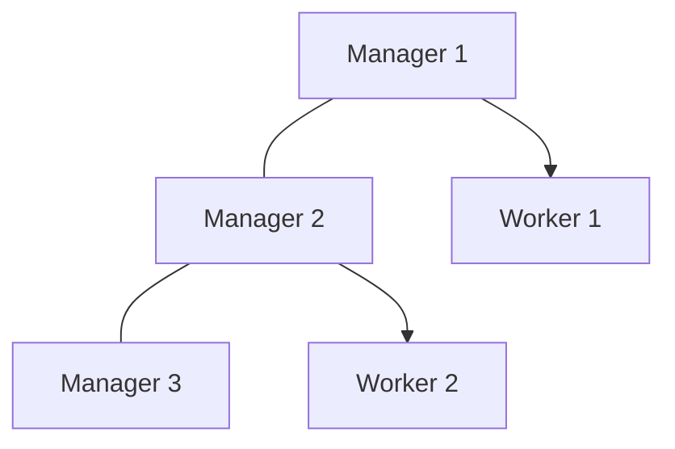

# Module 16 Notes — Docker Swarm
[Previous: Module 15 — Docker on Windows with WSL2](../15-docker-on-windows-wsl2/README.md) | [Next: Module 17 — Kubernetes Intro](../17-kubernetes-intro/README.md)

## What orchestration is and why you need it
**Concept:** Orchestration schedules, scales, heals, and updates containerized workloads across multiple machines.

**Why it exists:** Manual `docker run` on one host does not survive node failure, rolling deploys, or tens of replicas.

**How it works internally:** A control plane stores desired state; workers reconcile running tasks with that state.

**Command/Syntax:** You will use Swarm mode built into Docker Engine—no separate installer.

**Real example:** You run three nginx replicas across two VMs; if one VM dies, Swarm reschedules tasks on survivors.

## Swarm mode concepts
**Concept:** Swarm mode turns Docker Engines into a cluster with **manager** and **worker** nodes.

**Why it exists:** Managers run Raft consensus for cluster state; workers execute tasks.

**How it works internally:**
- **Managers:** Accept API requests, schedule services, maintain membership (odd count recommended: 1, 3, 5).
- **Workers:** Run containers assigned by managers.
- **Quorum:** Majority of managers must be healthy (3 managers tolerate 1 loss).
- **Raft:** Replicates cluster configuration between managers.



> 💡 **Pro Tip:** For production, use three or five managers. A single-manager swarm is fine for local learning only.

## Initialize a swarm
**Concept:** `docker swarm init` promotes the current daemon to a manager and issues join tokens.

**Why it exists:** You must form a cluster before creating services.

**How it works internally:** The node generates a Swarm ID, cluster CA, and overlay network foundations.

**Command/Syntax:**
```bash
docker swarm init
```
```text
Swarm initialized: current node (abc123) is now a manager
```

**Real example:** On your laptop you init a one-node swarm—all roles run on the same machine.

```bash
docker node ls
```
```text
ID        HOSTNAME   STATUS    AVAILABILITY   MANAGER STATUS
abc123 *  docker     Ready     Active         Leader
```

## Joining nodes
**Concept:** Workers and additional managers join with tokens from `docker swarm join-token`.

**Why it exists:** You expand capacity without reinstalling Docker.

**Command/Syntax:**
```bash
docker swarm join-token worker
```
```text
docker swarm join --token SWMTKN-1-... 192.168.1.10:2377
```

On the new machine:
```bash
docker swarm join --token SWMTKN-1-... 192.168.1.10:2377
```
```text
This node joined a swarm as a worker.
```

> ⚠️ **Common Mistake:** Opening port 2377 only on one interface while join commands use another IP—advertise the correct `--advertise-addr` at init time.

## Services vs standalone containers
**Concept:** A **service** is the desired state (image, replicas, ports); Swarm creates **tasks** (containers) to match.

**Why it exists:** Services give replication, load balancing, and rolling updates.

**How it works internally:** The scheduler places tasks on nodes with resources; the routing mesh publishes published ports on every node (ingress mode).

**Command/Syntax:**
```bash
docker service create --name web --publish 8080:80 --replicas 3 nginx:1.27
```
```text
overall progress: 3 out of 3 tasks
```

**Real example:** You scale an API from 2 to 5 replicas without scripting individual `docker run` commands.

## Service management commands
**Concept:** You inspect and operate services with the `docker service` subcommand.

| Task | Command |
|---|---|
| List services | `docker service ls` |
| List tasks | `docker service ps web` |
| Inspect | `docker service inspect web --pretty` |
| Scale | `docker service scale web=5` |
| Update image | `docker service update --image nginx:1.28 web` |
| Remove | `docker service rm web` |

**Command/Syntax:**
```bash
docker service ps web
```
```text
ID        NAME    IMAGE        NODE     DESIRED STATE   CURRENT STATE
xyz       web.1   nginx:1.27   docker   Running         Running 2 minutes ago
```

## Rolling updates and rollback
**Concept:** `docker service update` changes service spec; Swarm rolls tasks with parallelism and delay you configure.

**Why it exists:** Zero-downtime deploys require controlled replacement of tasks.

**How it works internally:** New tasks start; old tasks drain according to `--update-parallelism` and `--update-delay`.

**Command/Syntax:**
```bash
docker service update --image nginx:1.28 --update-parallelism 1 --update-delay 10s web
```
```text
web
overall progress: 3 out of 3 tasks
```

**Rollback:**
```bash
docker service rollback web
```
```text
web
rollback: rollback completed
```

> 💡 **Pro Tip:** Set `--rollback-parallelism` and test rollback in staging before production cutovers.

## Overlay networks in Swarm
**Concept:** **Overlay** networks span all Swarm nodes and connect multi-host service tasks.

**Why it exists:** Bridge networks on one host are insufficient for cross-node service DNS.

**How it works internally:** VXLAN encapsulation carries container traffic between nodes (ports 4789/udp among nodes).

**Command/Syntax:**
```bash
docker network create --driver overlay --attachable app-overlay
```
```text
app-overlay
```

```bash
docker service create --name api --network app-overlay --replicas 2 myapi:1.0
```
```text
overall progress: 2 out of 2 tasks
```

**Real example:** A `frontend` service resolves `api` via embedded DNS on the overlay network.

## Secrets and configs in Swarm
**Concept:** **Secrets** store sensitive data (TLS keys, passwords); **configs** store non-secret configuration files.

**Why it exists:** Environment variables in images leak; Swarm mounts secrets in-memory on nodes that run the task.

**Command/Syntax:**
```bash
echo "db_password" | docker secret create db_pass -
```
```text
db_pass
```

```bash
docker service create --name dbapp --secret db_pass myapp:1.0
```
```text
overall progress: 1 out of 1 tasks
```

**Configs:**
```bash
docker config create app_config ./app.conf
docker service create --name cfgdemo --config app_config nginx:1.27
```

> ⚠️ **Common Mistake:** Assuming secrets appear as environment variables automatically—they must be referenced in service definition (Compose `secrets:` section or service mount).

## Stacks (`docker stack deploy`)
**Concept:** A **stack** is a set of services deployed from a Compose file (version 3.x swarm-compatible fields).

**Why it exists:** You reuse Compose structure for multi-service apps in Swarm.

**How it works internally:** `docker stack deploy` converts Compose to service/network/secret objects.

**Command/Syntax:**
```bash
docker stack deploy -c swarm-stack.yaml demo
```
```text
Creating network demo_default
Creating service demo_web
```

See [examples/swarm-stack.yaml](examples/swarm-stack.yaml) and [examples/single-node-swarm-demo.md](examples/single-node-swarm-demo.md).

```bash
docker stack ls
docker stack services demo
docker stack rm demo
```

## When to use Swarm vs Kubernetes
| Factor | Docker Swarm | Kubernetes |
|---|---|---|
| Learning curve | Low if you know Docker | Steep |
| Built into Docker Engine | Yes | Separate distribution |
| Ecosystem / cloud support | Smaller | Industry default |
| Advanced scheduling / CRDs | Limited | Extensive |
| Multi-cluster / federation | Limited | Mature patterns |

**Concept:** Swarm suits smaller teams and simpler clusters; Kubernetes wins at large scale and platform features.

## Swarm limitations
- Smaller community and fewer third-party integrations than Kubernetes.
- No rich extension API (CRDs, operators) like Kubernetes.
- Docker Inc. focuses on Desktop and ecosystem; many enterprises standardized on Kubernetes.
- Single-platform (Docker Engine)—less portable across alternate runtimes.
- Feature development is maintenance mode relative to Kubernetes innovation.

> 💡 **Pro Tip:** Learn Swarm to understand orchestration primitives (desired state, replicas, rolling updates). Module 17 maps the same ideas to Kubernetes.

## Leave or reset a swarm
```bash
docker swarm leave --force
```
```text
Node left the swarm.
```

On workers without `--force`, run `docker swarm leave` after draining tasks.

## What's Next?
You get a bridge introduction to Kubernetes in Module 17—how Docker images and Compose concepts translate, not a full K8s course.

[Previous: Module 15 — Docker on Windows with WSL2](../15-docker-on-windows-wsl2/README.md) | [Next: Module 17 — Kubernetes Intro](../17-kubernetes-intro/README.md)
