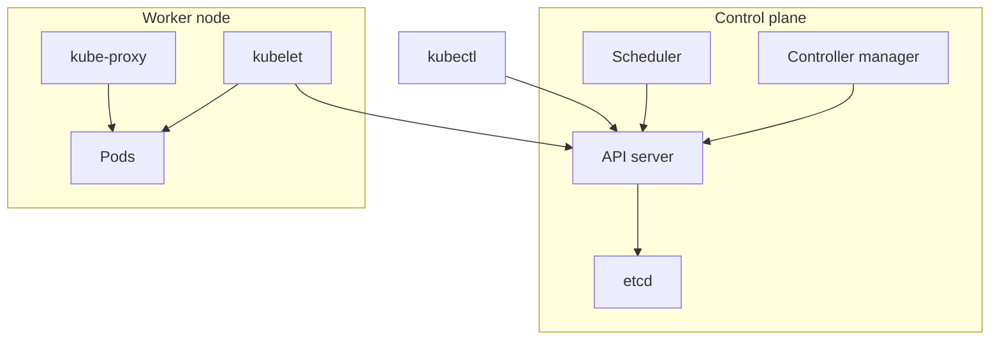

# Module 17 Notes — Kubernetes Introduction
[Previous: Module 16 — Docker Swarm](../16-docker-swarm/README.md) | [Next: Module 18 — CI/CD Pipelines](../18-cicd-pipelines/README.md)

> **Scope:** This module is a **bridge** from Docker to Kubernetes. You learn vocabulary, architecture, and one local deploy—you do **not** complete a full Kubernetes course here.

## Why Kubernetes exists
**Concept:** Kubernetes (K8s) is an open-source container orchestrator that automates deployment, scaling, networking, and healing at cluster scale.

**Why it exists:** Swarm and single-host Docker solve smaller problems well. Large organizations need pluggable storage, networking, RBAC, operators, multi-cluster patterns, and a vast ecosystem—areas where Kubernetes became the industry default.

**How it works internally:** You declare desired state as API objects; control plane components reconcile actual state continuously.

**Real example:** You run 50 microservice deployments across 200 nodes with rolling updates, autoscaling, and secrets rotation—beyond comfortable Swarm scope.

| Limitation you hit with Swarm/single host | What Kubernetes adds |
|---|---|
| Fewer cloud-native integrations | Universal support on AWS, GCP, Azure |
| Limited extension model | CRDs, operators, Helm ecosystem |
| Smaller community momentum | Large talent pool and tooling |

## Kubernetes architecture overview



| Component | Role |
|---|---|
| **API server** | Front door for all cluster changes and reads |
| **etcd** | Consistent key-value store for cluster state |
| **Scheduler** | Assigns new Pods to nodes |
| **Controller manager** | Runs loops that reconcile Deployments, Services, etc. |
| **kubelet** | Agent on each node; starts/stops containers in Pods |
| **kube-proxy** | Implements Service networking rules on the node |

**Concept:** The **control plane** makes decisions; **worker nodes** run your workloads.

> 💡 **Pro Tip:** When debugging, ask “Is the object accepted by the API server?” then “Is the scheduler/kubelet happy?” then “Is the Service routing traffic?”

## Core objects you should recognize
**Concept:** Kubernetes wraps containers in abstractions. These names appear in every tutorial and job interview.

| Object | Plain English | Docker / Swarm analog |
|---|---|---|
| **Pod** | Smallest deployable unit; one or more containers sharing network/storage | Closest to a task/group of containers |
| **Deployment** | Manages replicated Pods with rolling updates | Docker service / stack replica |
| **Service** | Stable network endpoint for Pods | Published port + load balancing |
| **ConfigMap** | Non-secret configuration data | Compose `configs` / env files |
| **Secret** | Sensitive data (base64 at rest; still protect RBAC) | Swarm secrets |
| **Namespace** | Logical cluster partition | Named project/environment |
| **PersistentVolumeClaim** | Request for durable storage | Named volumes |

**Command/Syntax:**
```bash
kubectl get pods,deployments,services -A
```
```text
NAMESPACE   NAME                    READY   STATUS
default     hello-xxx-yyy           1/1     Running
```

> ⚠️ **Common Mistake:** Treating a Pod as something you manually scale long-term. You usually create a **Deployment** and let it own Pods.

## Docker's role in Kubernetes
**Concept:** Kubernetes does not replace the OCI image format—you still build images with Docker (or BuildKit, `buildah`, CI pipelines).

**Why it exists:** Kubernetes schedules **containers** pulled from registries you already used in Modules 04 and 10.

**How it works internally:** The kubelet talks to a **container runtime** (containerd, CRI-O) which pulls your `myapp:1.0` image and runs it—same layers you built with `docker build`.

**Command/Syntax:**
```bash
docker build -t myuser/myapp:1.0 .
kubectl set image deployment/myapp myapp=myuser/myapp:1.0
```
```text
deployment.apps/myapp image updated
```

**Real example:** Your Module 09 multi-stage Dockerfile produces the image; Kubernetes only changes **where** and **how many** run it.

## `kubectl` basics
**Concept:** `kubectl` is the CLI for the Kubernetes API—like `docker` for a single daemon, but cluster-scoped.

**Why it exists:** Operators and developers need a stable command surface.

| Task | Command |
|---|---|
| Cluster info | `kubectl cluster-info` |
| Nodes | `kubectl get nodes` |
| Resources | `kubectl get deployments,pods,svc` |
| Describe | `kubectl describe pod <name>` |
| Apply manifest | `kubectl apply -f hello-k8s.yaml` |
| Delete | `kubectl delete -f hello-k8s.yaml` |
| Logs | `kubectl logs deployment/hello` |

**Command/Syntax:**
```bash
kubectl apply -f hello-k8s.yaml
```
```text
deployment.apps/hello created
service/hello created
```

```bash
kubectl get pods -w
```
```text
NAME                    READY   STATUS
hello-xxxxxxxxxx-yyyy   1/1     Running
```

## Local clusters: Minikube and kind
**Concept:** You practice Kubernetes on your laptop with a lightweight distribution.

| Tool | Summary |
|---|---|
| **Minikube** | Single-node cluster VM or container; built-in addons |
| **kind** (Kubernetes in Docker) | Cluster nodes run as Docker containers; fast for CI |

**Minikube example:**
```bash
minikube start
```
```text
😄  minikube v1.x.x on ...
✅  Done! kubectl is now configured to use "minikube"
```

```bash
kubectl get nodes
```
```text
NAME       STATUS   ROLES           AGE   VERSION
minikube   Ready    control-plane   1m    v1.30.x
```

**kind example:**
```bash
kind create cluster --name demo
```
```text
Creating cluster "demo" ...
```

> 💡 **Pro Tip:** Docker Desktop’s optional Kubernetes toggle is another local path—fine for quick experiments; `kind`/`minikube` match production tooling more closely.

## Mapping Docker Compose to Kubernetes
**Concept:** Compose describes multi-container apps on one host; Kubernetes manifests describe cluster objects.

See [examples/compose-to-kubernetes.md](examples/compose-to-kubernetes.md) for a side-by-side nginx + web app mapping.

| Compose key | Kubernetes approach |
|---|---|
| `services.web.image` | Container image in Deployment spec |
| `ports: "8080:80"` | Service `type: NodePort` or `LoadBalancer` + `port`/`targetPort` |
| `environment` | `env` in container spec or ConfigMap/Secret refs |
| `volumes` | PersistentVolumeClaim + volumeMounts |
| `depends_on` | Init containers, health probes, or application-level retry |
| `deploy.replicas` (Swarm) | `spec.replicas` on Deployment |

**Real example:** Module 08’s web + Postgres stack becomes separate Deployments, a Service for web, and a StatefulSet or Deployment plus PVC for Postgres in K8s—not one `docker compose up`.

## Deploy the sample app locally
**Concept:** You apply a minimal Deployment + Service to see the full flow once.

**Files:** [examples/hello-k8s.yaml](examples/hello-k8s.yaml)

**Command/Syntax:**
```bash
kubectl apply -f hello-k8s.yaml
kubectl port-forward service/hello 8080:80
```
```text
Forwarding from 127.0.0.1:8080 -> 80
```

In another terminal:
```bash
curl -s -o /dev/null -w "%{http_code}\n" http://127.0.0.1:8080
```
```text
200
```

```bash
kubectl delete -f hello-k8s.yaml
```
```text
deployment.apps "hello" deleted
service "hello" deleted
```

## Swarm vs Kubernetes (transition summary)
| Idea | Swarm | Kubernetes |
|---|---|---|
| Unit of scaling | Service task | Deployment → Pod |
| Discovery | Embedded DNS | Service + CoreDNS |
| Declarative files | Compose stack | YAML manifests / Helm charts |
| Install | `docker swarm init` | Managed cloud or kubeadm, kind, etc. |

You already understand **desired state**, **replicas**, and **rolling updates** from Module 16—Kubernetes uses different nouns for the same ideas.

## What to learn next (outside this repo)
**Concept:** After this bridge, continue with dedicated Kubernetes material.

**Suggested path:**
1. **Official Kubernetes basics tutorial** — pods, deployments, services, labels.
2. **kubectl practice** — imperatives vs declarative `apply`, `kustomize` intro.
3. **Ingress and storage** — expose HTTP services; PVCs for databases.
4. **Helm** — package and parameterize manifests.
5. **CKA/CKAD-style labs** — hands-on exams deepen operations skill.

**Resources (external):**
- [kubernetes.io/docs/tutorials](https://kubernetes.io/docs/tutorials/)
- [kubectl cheat sheet](https://kubernetes.io/docs/reference/kubectl/cheatsheet/)
- CNCF **Certified Kubernetes** learning paths if you want credentials

> ⚠️ **Common Mistake:** Jumping into Helm and GitOps before you can debug `kubectl describe pod` and read Events—master Pod lifecycle first.

## What's Next?
You automate Docker image builds in CI/CD pipelines in Module 18.

[Previous: Module 16 — Docker Swarm](../16-docker-swarm/README.md) | [Next: Module 18 — CI/CD Pipelines](../18-cicd-pipelines/README.md)
