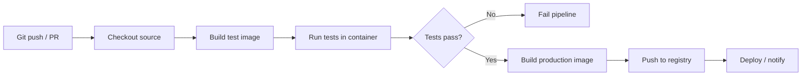
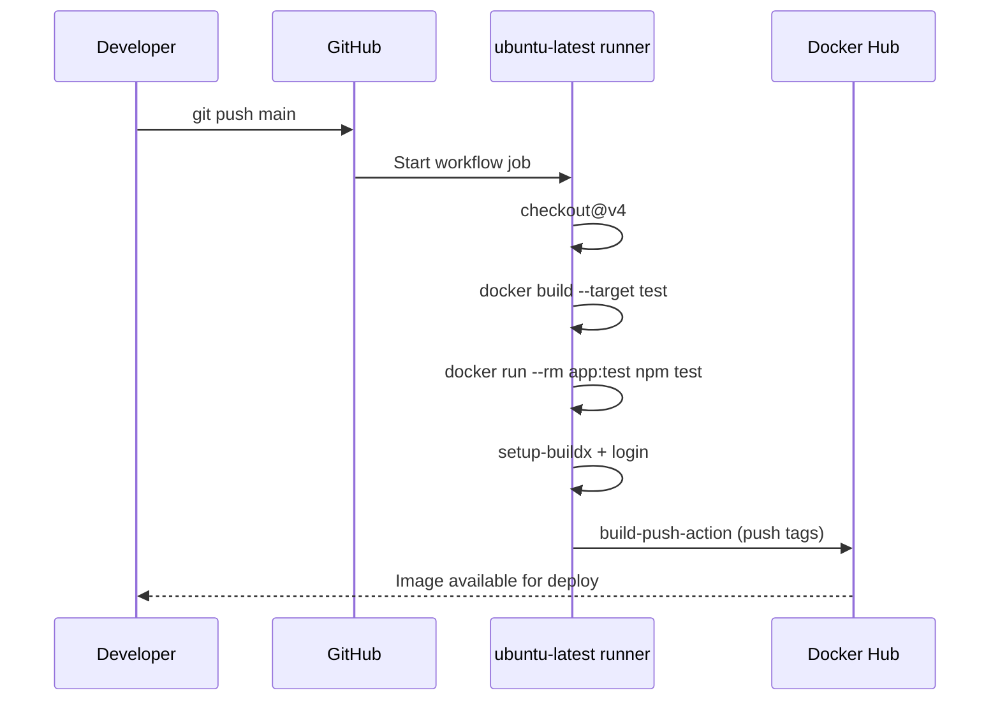
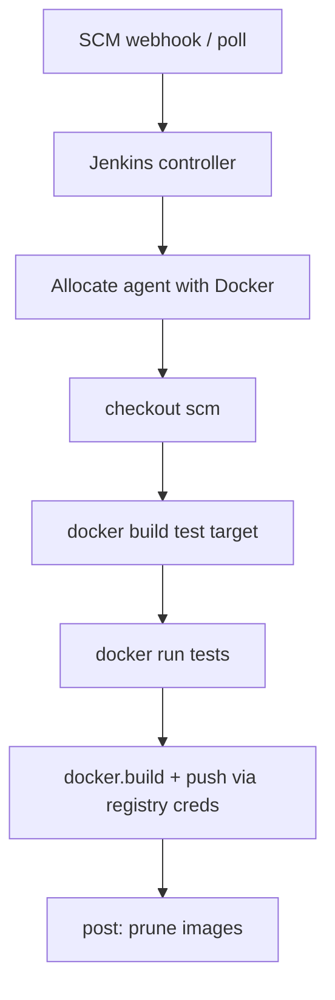

# Module 18 Notes — CI/CD Pipelines with Docker
[Previous: Module 17 — Kubernetes Intro](../17-kubernetes-intro/README.md) | [Next: Module 19 — Real-World Projects](../19-real-world-projects/README.md)

## Why Docker belongs in CI/CD
**Concept:** CI/CD automates build, test, and delivery every time code changes.

**Why it exists:** Manual image builds drift from source control and slow releases.

**How it works internally:** A pipeline runner checks out code, builds an OCI image with Docker Engine 25+ (BuildKit on by default), runs tests inside containers, and pushes immutable tags to a registry.

**Command/Syntax:**
```bash
docker build -t myapp:${GIT_SHA} .
```
```text
[+] Building 12.3s (18/18) FINISHED
```

**Real example:** On every push to `main`, GitHub Actions builds `myorg/myapp:abc123` and deploys that digest—not “whatever was on the laptop.”

> 💡 **Pro Tip:** Tag images with the Git commit SHA (`${{ github.sha }}` or `${GIT_COMMIT}`) so you can trace production back to exact source.

---

## CI/CD pipeline overview

Both GitHub Actions and Jenkins follow the same logical stages: trigger → checkout → test (in container) → build image → push to registry → (optional) deploy.



---

# Part A — GitHub Actions

## How GitHub Actions runs Docker jobs
**Concept:** GitHub provides hosted runners (Ubuntu, etc.) with Docker pre-installed on Docker Engine 25+ capable hosts.

**Why it exists:** You avoid maintaining build servers for open-source and many team workflows.

**How it works internally:** Each job runs in a fresh VM (or larger runner). Workflow steps are shell commands or marketplace actions that wrap the Docker CLI / Buildx.

**Command/Syntax:**
```yaml
runs-on: ubuntu-latest
```
```text
```

**Real example:** A workflow file lives at `.github/workflows/docker.yml` and triggers on `push` to `main`.

> ⚠️ **Common Mistake:** You store registry passwords in the workflow YAML. Use **GitHub Secrets** (`Settings → Secrets and variables → Actions`).

## GitHub Actions pipeline (detailed)



## Workflow triggers and jobs
**Concept:** `on` defines events; `jobs` group steps that run in parallel or sequence.

**Why it exists:** You run tests on every PR but push images only on `main`.

**How it works internally:** GitHub schedules jobs; `needs` enforces order; `if` guards conditional steps.

**Command/Syntax:**
```yaml
on:
  push:
    branches: [main]
  pull_request:
    branches: [main]
```
```text
```

**Real example:**
```yaml
jobs:
  test:
    runs-on: ubuntu-latest
  build-and-push:
    needs: test
    if: github.event_name == 'push' && github.ref == 'refs/heads/main'
```

## Running tests inside a container
**Concept:** CI runs the same environment your Dockerfile defines, not the host’s Node/Python version.

**Why it exists:** “Passed on the runner” matches “runs in the image.”

**How it works internally:** You build a `test` stage or target, then `docker run --rm` executes the test command.

**Command/Syntax:**
```bash
docker build --target test -t app:test .
docker run --rm app:test npm test
```
```text
PASS  3 tests
```

**Real example:** Add a Dockerfile stage:
```dockerfile
FROM node:22-alpine AS test
WORKDIR /app
COPY package*.json ./
RUN npm ci
COPY . .
CMD ["npm", "test"]
```

> 💡 **Pro Tip:** Use `docker compose run --rm api npm test` when your app is already defined in Compose.

## Build and push with official actions
**Concept:** `docker/login-action`, `docker/setup-buildx-action`, and `docker/build-push-action` are maintained wrappers for registry auth, Buildx, and push.

**Why it exists:** They handle credentials, provenance options, and multi-platform manifests correctly.

**How it works internally:** Buildx builds with BuildKit; `build-push-action` can push multiple platforms as one manifest list.

**Command/Syntax:** See the full example in [examples/docker.yml](examples/docker.yml).

**Real example — login and push:**
```yaml
- uses: docker/login-action@v3
  with:
    username: ${{ secrets.DOCKERHUB_USERNAME }}
    password: ${{ secrets.DOCKERHUB_TOKEN }}

- uses: docker/build-push-action@v6
  with:
    push: true
    tags: ${{ env.IMAGE_NAME }}:latest
```

> ⚠️ **Common Mistake:** You use your Docker Hub account password. Create an **access token** and store it as `DOCKERHUB_TOKEN`.

## Multi-platform builds (Buildx + QEMU)
**Concept:** One pipeline can produce `linux/amd64` and `linux/arm64` images for cloud and Apple Silicon nodes.

**Why it exists:** Registries store a manifest list; runtimes pull the matching architecture.

**How it works internally:** QEMU emulates foreign architectures on the runner; Buildx builds each platform and merges manifests on push.

**Command/Syntax:**
```yaml
- uses: docker/setup-qemu-action@v3
- uses: docker/setup-buildx-action@v3
- uses: docker/build-push-action@v6
  with:
    platforms: linux/amd64,linux/arm64
```
```text
```

**Real example:**
```bash
docker buildx build --platform linux/amd64,linux/arm64 -t user/app:latest --push .
```
```text
=> exporting manifest list
```

> ⚠️ **Common Mistake:** Multi-platform builds without QEMU fail on single-arch runners with obscure errors.

## Layer caching in GitHub Actions
**Concept:** Registry or GitHub Actions cache stores BuildKit cache blobs between runs.

**Why it exists:** Repeated `npm ci` / `apt` layers dominate build time; cache cuts minutes to seconds.

**How it works internally:** `cache-from` / `cache-to` with `type=gha` uses the Actions cache API; alternatively `type=registry` reuses layers from a `buildcache` tag.

**Command/Syntax:**
```yaml
cache-from: type=gha
cache-to: type=gha,mode=max
```
```text
```

**Real example — registry cache tag:**
```yaml
cache-from: type=registry,ref=${{ env.IMAGE_NAME }}:buildcache
cache-to: type=registry,ref=${{ env.IMAGE_NAME }}:buildcache,mode=max
```

> 💡 **Pro Tip:** Order Dockerfile instructions from least to most frequently changed to maximize cache hits.

## Secrets and environment variables
**Concept:** Secrets are encrypted values; `env` sets job-level variables.

**Why it exists:** Tokens never appear in logs when referenced as `${{ secrets.NAME }}`.

**How it works internally:** GitHub injects secrets at runtime; forked PR workflows do not receive secrets unless you explicitly allow it.

**Command/Syntax:**
```bash
# Local test only — never commit
export DOCKERHUB_TOKEN=...
```
```text
```

**Real example:** Repository secrets:
- `DOCKERHUB_USERNAME`
- `DOCKERHUB_TOKEN`

---

# Part B — Jenkins

## Jenkins pipeline model
**Concept:** Jenkins executes a `Jenkinsfile` (declarative or scripted) checked into the repo.

**Why it exists:** Enterprises often standardize on Jenkins for plugins, RBAC, and on-prem agents.

**How it works internally:** A controller schedules work on agents; stages run steps (`sh`, `docker.build`, etc.).

**Command/Syntax:**
```groovy
pipeline {
    agent { label 'docker' }
    stages { ... }
}
```
```text
```

**Real example:** See [examples/Jenkinsfile](examples/Jenkinsfile).

## Jenkins CI/CD flow



## Docker on Jenkins agents
**Concept:** The agent must reach a Docker daemon to build images.

**Why it exists:** Jenkins nodes without Docker cannot execute `docker build`.

**How it works internally:** Common patterns: (1) cloud VM with Docker Engine installed, (2) static agent with socket mount, (3) Kubernetes pod with DinD sidecar.

**Command/Syntax:**
```groovy
agent {
    docker {
        image 'node:22-alpine'
        args '-v /var/run/docker.sock:/var/run/docker.sock'
    }
}
```
```text
```

**Real example:** Label `docker` matches agents in `Manage Jenkins → Nodes` that expose the CLI and socket.

## Building and pushing from Jenkins
**Concept:** The Docker Pipeline plugin provides `docker.build()` and `docker.withRegistry()`.

**Why it exists:** Groovy steps handle login/logout around push without shell scripting errors.

**How it works internally:** Jenkins wraps `docker build` and `docker push` on the agent daemon.

**Command/Syntax:**
```groovy
docker.withRegistry('https://index.docker.io/v1/', 'dockerhub-credentials') {
    def img = docker.build("${IMAGE}:${TAG}")
    img.push()
    img.push('latest')
}
```
```text
```

**Real example:** Create credential ID `dockerhub-credentials` (Username with password) using a Hub access token as the password.

## Docker-in-Docker (DinD) vs Docker socket mount

| Approach | How it works | Pros | Risks |
|---|---|---|---|
| **Socket mount** (`-v /var/run/docker.sock:/var/run/docker.sock`) | Container uses host daemon | Fast, simple, layer cache on host | Container with socket access ≈ root on host; escape risk |
| **Docker-in-Docker** (`docker:dind` sidecar or `privileged: true`) | Nested daemon inside job | Isolated daemon per job | Slower, privileged containers, volume/graph complexity |
| **Kaniko / buildah** (no daemon) | Userspace image build | No socket on agent | Different cache and Dockerfile feature support |

**Concept:** Socket mount is common in trusted CI; DinD suits stronger isolation when you accept operational cost.

**Why it exists:** Build tools need a daemon—or a daemonless builder.

**How it works internally:** Socket mount talks to the host’s `dockerd`; DinD runs a second `dockerd` (often with `--storage-driver` tuning).

**Command/Syntax:**
```bash
# DinD service container (simplified)
docker run --privileged docker:dind
```
```text
```

**Real example:** GitHub-hosted runners already provide Docker safely for public workflows; on Jenkins, restrict who can define pipelines when the socket is mounted.

> ⚠️ **Common Mistake:** You mount the Docker socket in untrusted multi-tenant Jenkins without job isolation—any job can start a privileged container and compromise the host.

> 💡 **Pro Tip:** For production Jenkins on Kubernetes, consider **Kaniko** or **buildkitd** as a remote builder instead of wide socket sharing.

## Local Jenkins with Compose
**Concept:** Project 07 spins up Jenkins in Docker for practice.

**Why it exists:** You learn CI without a corporate Jenkins install.

**How it works internally:** Compose maps port `8080`, persists `jenkins_home` in a volume, and mounts the socket for Docker builds.

**Command/Syntax:**
```bash
docker compose -f projects/project-07-cicd-jenkins/docker-compose.yml up -d
```
```text
[+] Running 1/1
```

**Real example:** After unlock, install plugins: **Docker Pipeline**, **Pipeline**, **Git**.

---

## Security checklist for Docker CI/CD

1. Use short-lived registry tokens, not account passwords.
2. Push only from protected branches (`main`).
3. Pin action versions (`@v4`, `@v6`) to avoid supply-chain surprises.
4. Scan images in CI (`docker scout cves` or Trivy) before deploy.
5. Never echo secrets in shell scripts; use built-in secret masking.
6. Treat Docker socket access as **root-equivalent** on the agent host.

---

## Engine 25+ and Compose v2 reminders

- **BuildKit** is default: `docker build` = `docker buildx build` on most installs.
- Use the **Compose v2 plugin**: `docker compose`, not legacy `docker-compose` v1.
- Verify versions in CI:
```bash
docker version --format '{{.Server.Version}}'
docker compose version
```
```text
25.0.3
Docker Compose version v2.29.2
```

---

## What’s Next?
You apply everything in hands-on **real-world projects**—eight production-style repos linked from Module 19. Start with [Project 06 — CI/CD with GitHub Actions](../../projects/project-06-cicd-github-actions/README.md) and [Project 07 — CI/CD with Jenkins](../../projects/project-07-cicd-jenkins/README.md).

[Previous: Module 17 — Kubernetes Intro](../17-kubernetes-intro/README.md) | [Next: Module 19 — Real-World Projects](../19-real-world-projects/README.md)
